<a href="https://github.com/web4foundation">
    <picture>
        <source srcset="https://brand.web4.dev/web4/header/dark.svg" media="(prefers-color-scheme: dark)">
        
    </picture>
</a>

<table>
  <tr>
    <td></td>
    <td>
      <h2>Rylan Barnes</h2>
      <b>Engineer. Designer. Software bushwhacker.</b> 
      📍 Dallas-Fort Worth Metroplex 
      🌐 <a href="https://rylan.io">rylan.io</a> · 💼 <a href="https://www.linkedin.com/in/rylanbarnes/">LinkedIn</a> 
      Most of my work lives at <a href="https://github.com/web4foundation">github.com/web4foundation</a>.
    </td>
  </tr>
</table>

## Experience

<table>
  <tr>
    <td></td>
    <td><b>BDFL</b> The Web4 Foundation Oct 2023 - Present</td>
  </tr>
</table>

My latest side project is a nonprofit organization called The Web4 Foundation (formal status in progress). Its mission is to advance of the open web through its fourth chapter: local-first, native webapps. Similar to organizations like W3C and WHATWG, the Web4 Foundation also stewards, defines, and extends the standards of the open web. However, since Web4 executes extramurally instead of inside the browser, its scope of influence is not targeted towards browser vendors but rather towards language communities. Web4's directive is to support the consistent implementation of these standards across all language communities to maximize skill-portability and minimize framework-fatigue.

<table>
  <tr>
    <td width="33%" valign="top">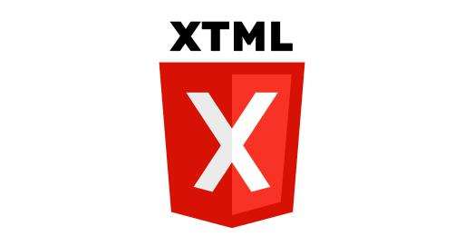 <b>XTML</b> Compile HTML into its own binary (html.exe or html.wasm). Like JSX, except instead of putting HTML inside your JS, you put compiled langs inside your HTML.</td>
    <td width="33%" valign="top">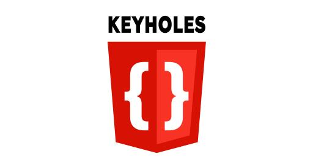 <b>Keyholes</b> The DOM's doorway to other languages. Like React but runs from WASM or the server, hardware-accelerated reconciliation, interops with the DOM remotely.</td>
    <td width="33%" valign="top">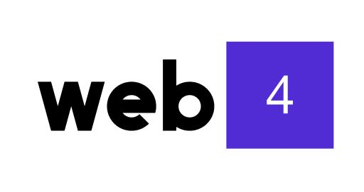 <b>Web4 SDK for .NET</b> The reference implementation and the first of many SDKs to come. Started with C# since this species of webapps has much in common with video game dev.</td>
  </tr>
</table>

---

<table>
  <tr>
    <td>🏦</td>
    <td><b>Principal Mobile Architect</b> Concord Finance Dec 2022 - Present</td>
  </tr>
</table>

Designed and built Concord's native apps for both iOS and Android. Used SwiftUI for iOS and Kotlin/Compose for Android. These were architected in such a way that they were essentially line-for-line ports of each other which was necessary since I was a team of only one. Since Concord is a P/E rollup there were multiple legacy backends that effectively did the same thing but this single app needed to be able to swap backends at runtime based on the login. I was able to achieve 100% reuse of the UI layer and fully decouple it from the business logic by inverting the architecture such that each backend could implement their own logic and API access as needed and then drive the shared UI through a single monolithic ViewModel.

---

<table>
  <tr>
    <td></td>
    <td><h3>ShopSavvy Inc.</h3></td>
  </tr>
</table>

#### Cofounder & CTO (Monolith, LLC)
Nov 2018 - Dec 2022

We bought ShopSavvy back from Purch to see where we could take this mobile shopping app next. I built many things there but the two I found most interesting were

1. a social shopping feed capable of operating in offline mode by leveraging local-first data for friends' posts and optimistic updates for your own
2. a web browser optimized for shopping by beginning the user in a native experience that could - when visiting product URLs - minimize itself into an overlay drawer with the webpage in the backdrop and price comparison in the native UI overlay (quite similar to what X implemented years later)

<table>
  <tr>
    <td width="50%" valign="top"><a href="https://www.youtube.com/watch?v=T3pe9nLnNyI">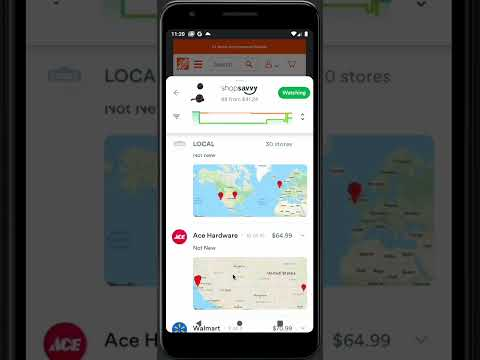</a> <b>Native/Browser Demo</b></td>
    <td width="50%" valign="top"><a href="https://www.youtube.com/watch?v=Y-R7LSAQK2w">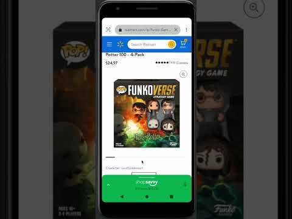</a> <b>Native/Browser Demo</b></td>
  </tr>
</table>

#### VP Software Engineering - Mobile & Emerging Platforms (Purch, Inc.)
Nov 2015 - Nov 2018

<table>
  <tr>
    <td width="50%" valign="top"><a href="https://techcrunch.com/2015/12/17/purch-acquires-shopsavvy/">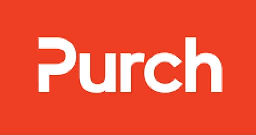</a> <b>Purch Acquires ShopSavvy | TechCrunch</b> Purch just announced that it has acquired ShopSavvy, the mobile shopping startup backed by Facebook co-founder Eduardo Saverin. Purch was formerly known as TechMediaNetwork and operates sites including Tom's Guide and AnandTech. The company...</td>
  </tr>
</table>

#### Created QuickPay
Nov 2011 - Nov 2015

QuickPay, which was granted a patent, was a zero-keyboard agentic checkout feature added to ShopSavvy that acted like auto-fill on steroids - instead of auto-populating form fields, it handled the entire flow start to finish in the background saving roughly 150 keystrokes. This solved a major drop-off in our funnel since users loved scanning barcodes for pricing research but were disinclined to suffer through a lengthy checkout process from a tiny screen in the middle of the aisle of the store from a new-to-them retailer where they had no account or previously stored payment methods. Usually they'd wait until they were home at their computer to navigate directly to retailer we showed them earlier which circumvented our affiliate links causing us to lose out on roughly 4% of each transaction. QuickPay was especially useful since smaller retailers at that time had exceedingly unpolished checkout flows partly due to Amazon's 1-Click patent being active until 2017.

<table>
  <tr>
    <td width="50%" valign="top"><a href="https://www.youtube.com/watch?v=jbzSqDeBzYo">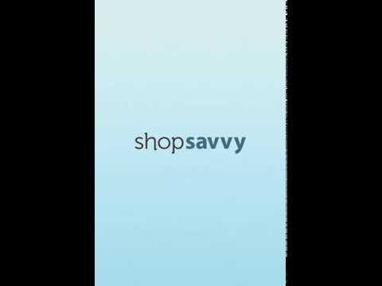</a> <b>ShopSavvy QuickPay</b></td>
  </tr>
</table>

#### Created Chalupa
Jun 2010 - Nov 2015

Chalupa was essentially Meatloaf (detailed below) operating from the cloud using UDP packets like multiplayer video game servers. Chalupa ran in parallel to a locally running Meatloaf to improve barcode scanning performance in a first-to-decode solution. The problem was that, while Meatloaf worked great on most phones, some budget phones could take a full second to decode a single image and most of the captured frames were 'throw-away' frames. On a live camera feed a single captured frame often had barcode bars obscured by glare from overhead lights and every slight jerk of the wrist introduced significant motion blur when operating with longer exposure settings (i.e. indoors). It wasn't uncommon for there to be only one good frame for every 30 throw-away frames which made the scanner very difficult to use. To improve this, uploading a live video feed to a fast server over 2G or 3G connections was unrealistic. But product barcodes (UPCs and EANs) had a significant advantage, they're 1-dimensional. Chalupa took a single frame from the live camera feed, extracted a single scanline from the middle (320 pixels across), and for each pixel, averaged the three color channels (RGB) into one greyscale signal 320 bytes long. UDP packets were used since Chalupa operated 'opportunistically' so the overhead of in-order guaranteed delivery (TCP) was overkill. A single UDP packet could fit 4 scanlines and the ideal frame rate was roughly 4 frames per second. On the server, decoding took only a few milliseconds was fully multithreaded, and peak traffic (Black Friday) didn't require more than 7 servers to support the load.

<table>
  <tr>
    <td width="50%" valign="top"><a href="https://www.youtube.com/watch?v=hvj8EgUxUac">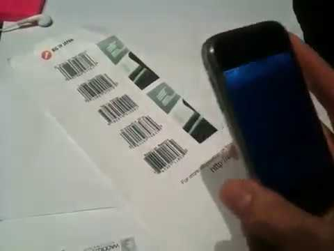</a> <b>Barcode Scanning SDK</b></td>
  </tr>
</table>

#### Created Meatloaf
Nov 2009 - Nov 2015

Meatloaf was a barcode scanning library for the iPhone engineered specifically for blurry barcodes. Unlike Android, the first couple of iPhone generations had cameras with a fixed-focus lens. Because of this, scanning a barcode was always blurry since it needed to be held roughly 6 inches away. But running blind deconvolutions to clear up the image was too computationally intensive to do at multiple frames per second on 2007 mobile hardware. So I wrote Meatloaf which solved the problem backwards. Instead of trying to clear up blurry photos, it worked by taking known barcode patterns, pre-blurring them ahead of time so they could be compared for similarity to the captured blurry image in a piecewise approach, one digit at a time. Meatloaf worked remarkably well considering the constraints. We eventually licensed the tech to Macys & Sam's Club. We were one of only three teams in the world that managed to cracked this puzzle giving ShopSavvy a multi-year head start in the mobile shopping category. A few years later, it became unnecessary when iPhones eventually started shipping with auto-focus cameras.

<table>
  <tr>
    <td width="50%" valign="top"><a href="https://www.youtube.com/watch?v=QSlpodFvXKY">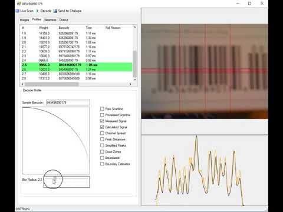</a> <b>Meatloaf</b></td>
  </tr>
</table>

#### Cofounder & CTO
Aug 2008 - Nov 2015

ShopSavvy started as a mobile app for scanning barcodes, comparing prices and reading reviews, founded on the early momentum of GoCart.

- Since 2008 - one of the oldest apps around, was in Google's app store the day Android launched
- Over 40 millions downloads
- In 2011, raised a series-A from Facebook cofounder Eduardo Saverin
- Acquired by Purch in 2015

<table>
  <tr>
    <td width="50%" valign="top">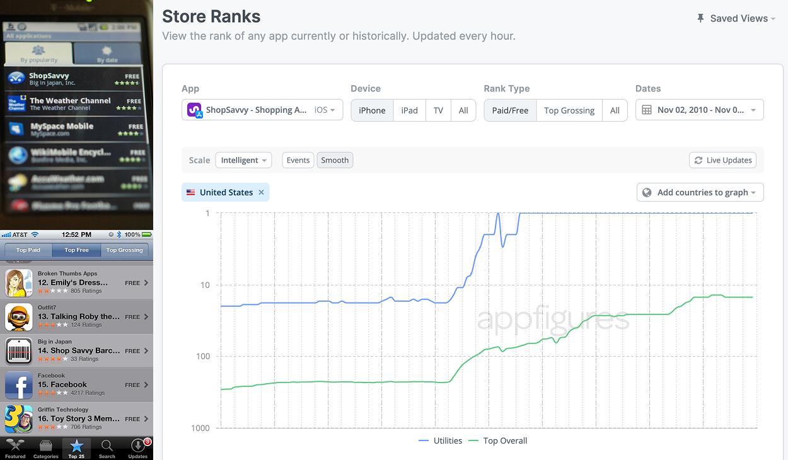 <b>Ranked #1 in the app stores</b> We focused obsessively and it paid off - ranking as high as #1 in our category and #14 overall. We eventually got our iPhone version performing as well as it did on Android despite not having any marketing help on the Apple side. We had to build some crazy barcode scanning tech called Meatloaf to make it work. It gave us quite a competitive advantage on the iPhone for the next couple of years.</td>
  </tr>
</table>

---

<table>
  <tr>
    <td>🛠️</td>
    <td><h3>Side Projects</h3></td>
  </tr>
</table>

#### XImage
Jan 2011 - Nov 2015

XImage was server middleware enabling just-in-time image transformations from the query string. It merged my fascination of low-level graphics processing with my love for high-performance web servers. This project solved a pain point between design and engineering teams regarding the pixel-perfect implementation of 'asset embellishments' for large image buckets (e.g. millions of product images or user avatars). Additionally, it reduced the duplicate effort required to re-implement it across 3 platforms - web, native iOS, and native Android. As example, imagine designing a hero image requiring a very specific aspect ratio, cropped-to-fit, and filling in the letterboxing with with a blurry-background-crop-to-fill or maybe imagine a user avatar with a circular mask, forced PNG format to support transparent backgrounds, with a 2px white stroked outline and a subtle drop shadow. These types of requirements were common for 2011 in mobile's skeuomorphic era before Jony Ive flattened UI design. XImage solved this problem by serving as middleware on our webservers that could perform numerous GPU-accelerated image effects in real-time at the time of the request based on instructions from the query string. XImage served billions of images before eventually being retired. The need for such transformations became rare in a post-skeuomorphic world and what minor needs remained were handled well enough by commodity CDNs.

#### PriceNark
Jan 2004 - Dec 2010

PriceNark was a realtime price comparison service. It differed from traditional web crawlers in that, instead of store-and-index, it would screen scrape at the time of the request (i.e. when a user scanned a barcode). This provided always-accurate pricing in a space where the lowest price often changed hourly (mostly due to auction sites like eBay and half.com). Back then the web was a pretty different place - servers still used single-core CPUs, async/await was not yet invented, JSON was not yet specified, and nearly every web server was still CGI-based which meant it sent HTML over the network by alternating back and forth between print commands to stdout then blocking for the next SQL query dozens of times for each page. It wasn't uncommon for e-commerce webpages to take multiple seconds before being fully received by the browser (mostly due to the extra content 'below the fold'). Since PriceNark's target content (the price) was always 'above the fold' and sent in the first few network packets, it was built using an approach that could parse HTML chunks as the packets were received from the network and immediately flush found prices to the API response as a XML nodes of a chunked-transfer-encoding HTTP/1.1 response. The resulting experience was remarkable in that, the native app appeared to show a retailer's price faster than its own website could.

#### GoCart
Feb 2008 - Aug 2008

GoCart was a barcode-scanning price comparison app. It was a first-prize winner ($275,000) in Google's global competition - the Android Developer Challenge. This led to being a launch partner with T-Mobile for the G1, Android's first phone which resulted in inclusion of a few TV commercials and other marketing materials (like in the design of G1 box). GoCart was renamed to ShopSavvy at T-Mobile's request. It's one of the oldest Android apps you can find since it was live in their app store the day of Android's launch.

<table>
  <tr>
    <td width="50%" valign="top"> <b>Jimmy Fallon</b> Since ShopSavvy was one of the featured apps during Google's launch of Android, it was often used to showcase their latest hardware. Scanning barcodes was unique to Android initially since Apple didn't make (official) streaming camera APIs available until 2010.</td>
    <td width="50%" valign="top"><a href="https://www.youtube.com/watch?v=g1EquZqwDIk">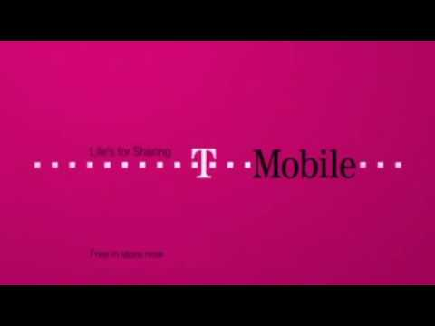</a> <b>ShopSavvy T-Mobile commercials</b> Since ShopSavvy was one of the featured apps during Google's launch of Android, it was often included in T-Mobile commercials (their network partner). These commercials aired in the US and UK.</td>
  </tr>
  <tr>
    <td width="50%" valign="top">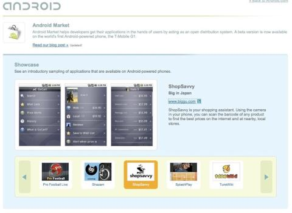 <b>Android's app store launched with ShopSavvy</b> ShopSavvy was an OG Android app, available the day Google Play went live. This is what the Play Store originally looked like, can you believe it? There was no admin console yet and for every new release, I had to email my APK to 'Jason' on Google's Android team who ran a script from his laptop to get it uploaded.</td>
    <td width="50%" valign="top">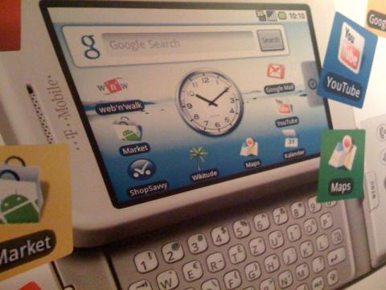 <b>On the box</b></td>
  </tr>
</table>

---

<table>
  <tr>
    <td>🎟️</td>
    <td><b>Software Developer</b> Veritix (now AXS) Sep 2006 - Aug 2008</td>
  </tr>
</table>

Veritix did event ticketing (like Ticketmaster). There, I built the first known JavaScript-based seat picker (competitors used Flash). It featured isometric 3D maps made possible using custom affine transformations. VRML-based vector graphics were used since SVG support was limited at that time (i.e. Chrome did not exist yet and IE was ~90% of our traffic). Before that I built a Windows-native Kiosk app for purchasing tickets outside of event venues. It needed to be a full screen WinForms app running on a touch screen monitor so, to make it more touch-friendly, I overrode WinForm's render pipeline to handle physics-based scrolling and animated transitions with non-linear easing curves - table stakes today but innovative for its time considering this was all pre-iPhone.

<table>
  <tr>
    <td width="50%" valign="top">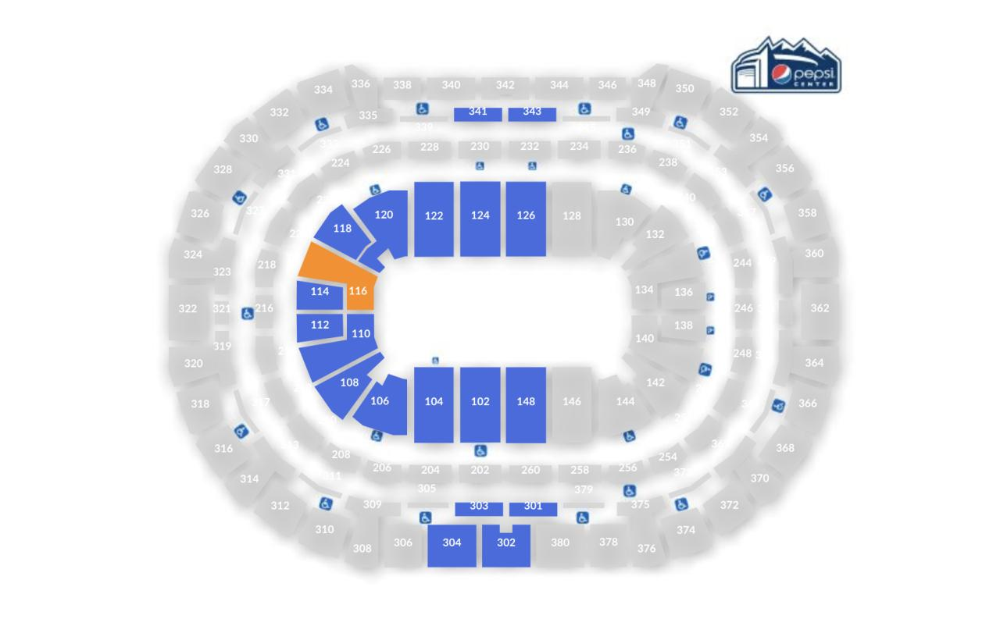</td>
    <td width="50%" valign="top">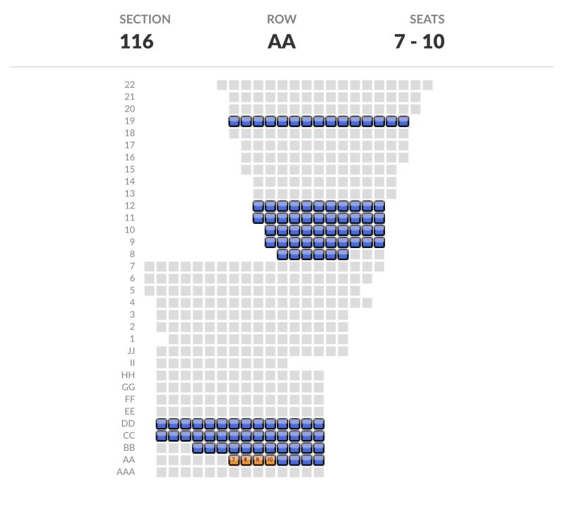</td>
  </tr>
  <tr>
    <td colspan="2"><b>Pick a Seat</b> One of the first interactive (non-Flash) pick-a-seat UIs on the web.</td>
  </tr>
</table>

---

<table>
  <tr>
    <td>💼</td>
    <td><b>Consultant</b> Software Architects (now Pariveda) Jan 2006 - Sep 2006</td>
  </tr>
</table>

A mix of UI and large databases.

---

<table>
  <tr>
    <td></td>
    <td><h3>HP</h3></td>
  </tr>
</table>

#### Intern
May 2004 - Dec 2005

Web dev in the server division. Texas A&M had an on-campus facility where I could attend school and work as an intern at the same time.

#### Co-op
Jan 2004 - May 2004

Web dev in the server division. Full-time work, no school.

## Education

<table>
  <tr>
    <td></td>
    <td><b>Texas A&amp;M University</b> BS, Computer Engineering Sep 2000 – Dec 2005</td>
  </tr>
</table>

In college I led a team that built a physical chess board that could play against you. This was before Raspberry Pis, so we programmed an FPGA board to control two servos that moved an electromagnet on an Etch-a-sketch type of actuator. That was then plugged into a PC that ran a modified version of the WinBoard chess AI.

<table>
  <tr>
    <td width="50%" valign="top"> <b>Robotic Chess AI</b></td>
  </tr>
</table>

---

<table>
  <tr>
    <td></td>
    <td><b>Berkner High School</b> Sep 1996 – May 2000</td>
  </tr>
</table>

Made a game in this crazy new language called JavaScript. Web dev was pretty wild in the 90s. Kudos to browser developers though: it still works after almost 30 years (thanks WHATWG)!

## Projects

#### Design
Jan 1999 – Apr 2026

LinkedIn was never intended to showcase design portfolios so I stuffed a few logos I designed here. I've got a few very interesting takes about UI design; you should ask me about them sometime. Started designing UI in the 90s using Gimp (and Photoshop when possible). These days it's primarily Figma.

<table>
  <tr>
    <td width="50%" valign="top">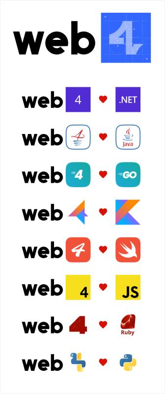 <b>Web4 Logos - an ecosystem of ecosystems</b></td>
    <td width="50%" valign="top">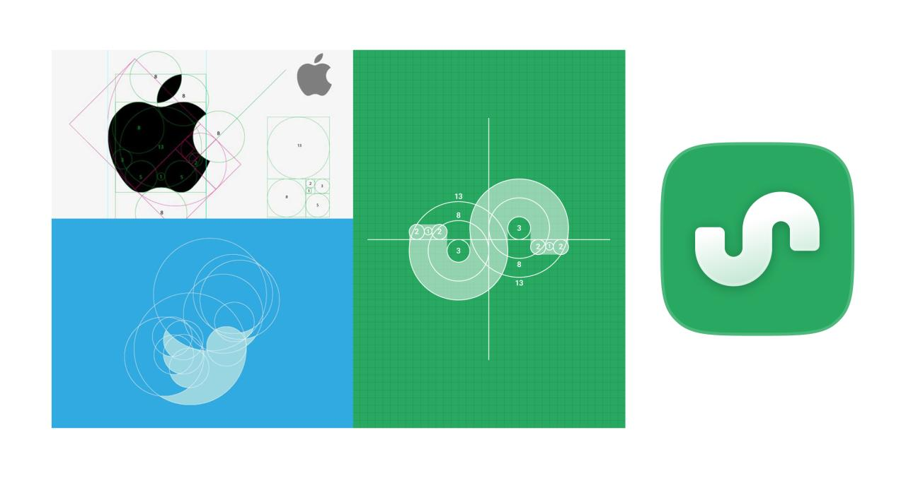 <b>ShopSavvy Logo</b></td>
  </tr>
  <tr>
    <td width="50%" valign="top">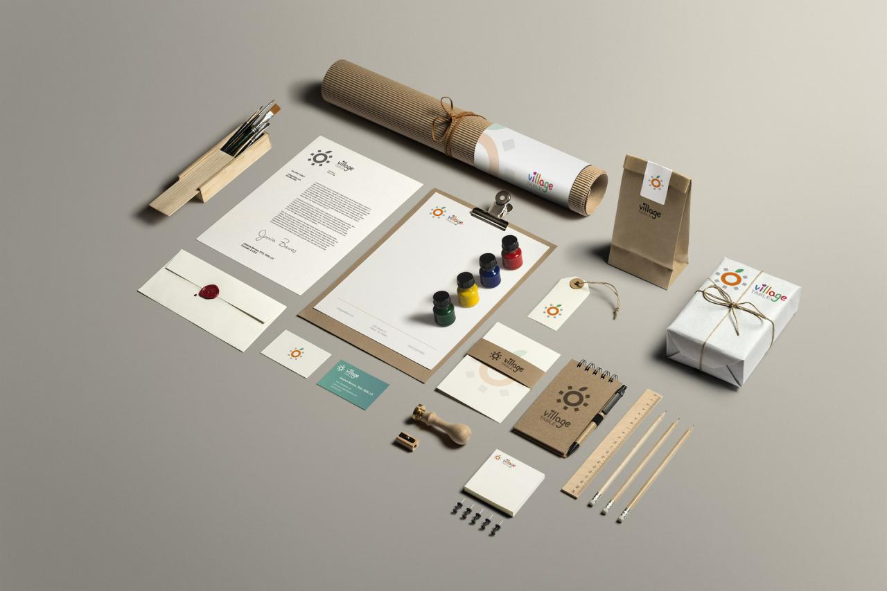 <b>Village Table Logo</b></td>
    <td width="50%" valign="top">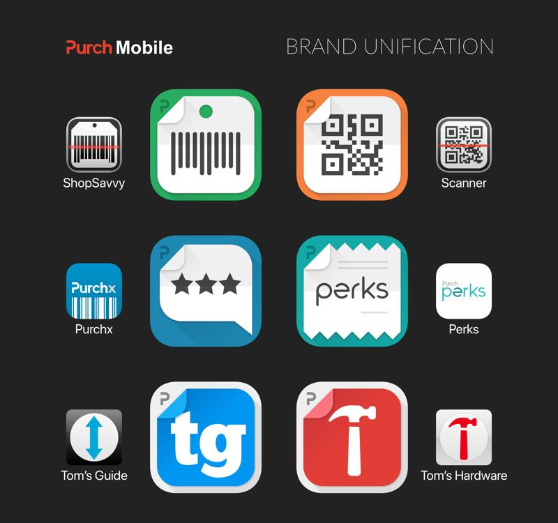 <b>Purch Mobile Brand Unification</b></td>
  </tr>
</table>

## Honors & Awards

#### 1st Prize Winner - Google's Android Developer Challenge
Issued by Google · Sep 2008

My app GoCart won first prize of $275,000 among 1,788 entries from over 70 countries. Built with Android's Beta SDK, it's older than the app store itself. This app was later renamed to ShopSavvy.
